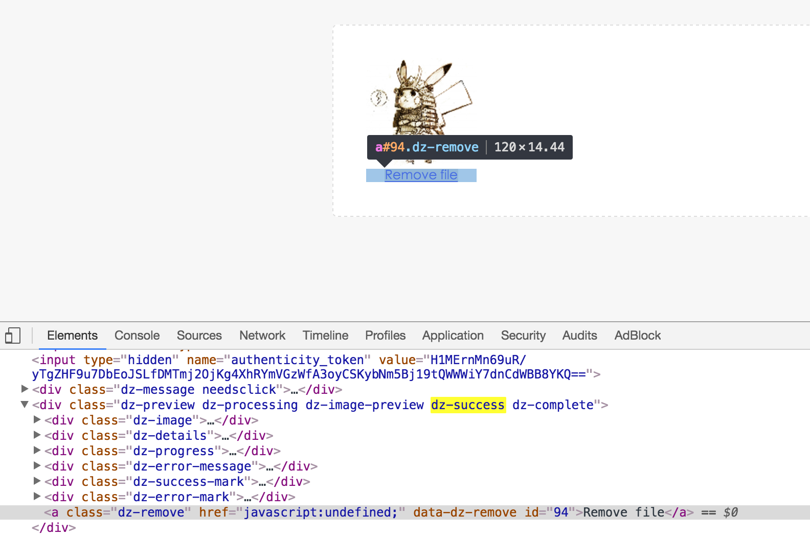
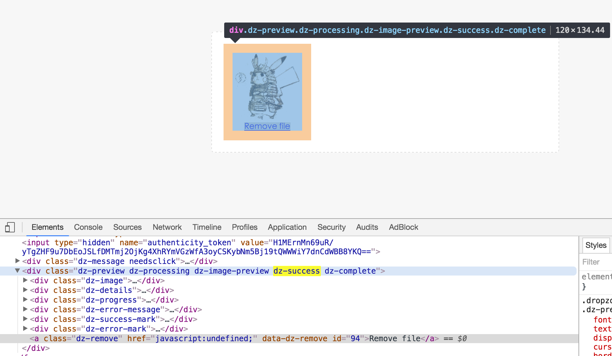
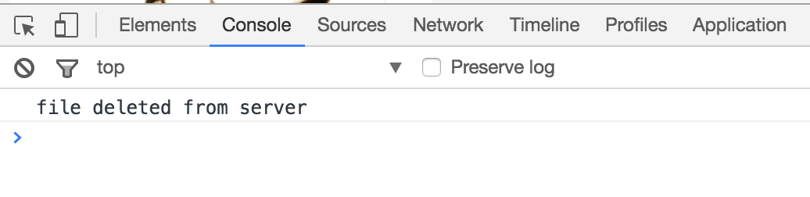

# 解構

最後找到用paperclip實作我的目標的教學影片
- [Part1：Ruby on Rails Ajax Files Upload with Dropzone - Upload, Drag and drop files - YouTube](https://www.youtube.com/watch?v=ic4MeDEfT08)
- [Part2：Ruby on Rails Ajax Files Upload with Dropzone - List and delete file on server - YouTube](https://www.youtube.com/watch?v=PupYpBKOieA)
  - 除了paperclip外，也用了這個Gem：[dropzonejs-rails](https://github.com/ncuesta/dropzonejs-rails)
    - 看了該Gem的README，發現他是改編自[Dropzone.js](http://www.dropzonejs.com)
      - 必須要搭配這個API看，才看得懂他寫的code在幹麻
    - 官方wiki：[Home · enyo/dropzone Wiki](https://github.com/enyo/dropzone/wiki)
- 該作者也把專案放到GitHub上面：[rails_dropzone example - GitHub](https://github.com/edomaru/rails_dropzone)

>PS：跟朋友討論到，也可以用[jQuery-File-Upload](https://github.com/blueimp/jQuery-File-Upload)實作

# 上傳圖片的頁面

[rails_dropzone/app/views/uploads/index.html.erb](https://github.com/edomaru/rails_dropzone/blob/master/app/views/uploads/index.html.erb)
- 透過`file_field`來選擇圖片：[rails API -file_field](http://api.rubyonrails.org/classes/ActionView/Helpers/FormHelper.html#method-i-file_field)
- 若想改掉Dropzone.js內建的defal message，則可以用`dz-message`：[Dropzonejs - Tips](http://www.dropzonejs.com/#tips)，搜尋「dz-message」

上傳檔案要寫`multipart: true`
- [file_field_tag - rails API](http://api.rubyonrails.org/classes/ActionView/Helpers/FormTagHelper.html#method-i-file_field_tag)，搜尋「 multipart: true」


在form_for上傳檔案：目前看到兩種說法
- 不需要寫`multipart: true`
  - [5 檔案上傳 - Action View 表單輔助方法 — Ruby on Rails 指南](http://rails.ruby.tw/form_helpers.html#檔案上傳)
  - [comment 1：ruby on rails - Form_for with :multipart => true spits out - Stack Overflow](http://stackoverflow.com/a/10526674)
- 要寫`multipart: true`
  - [Using the form_for Method with multipart in Rails | Antun's Blog](http://www.antunkarlovac.com/blog/2008/08/22/using-the-form_for-method-with-multipart-in-rails/)
  - [omment 2：ruby on rails - Form_for with :multipart => true spits out - Stack Overflow](http://stackoverflow.com/a/15760352)

由於範例是2016年初的影片，所以`form_for`我決定用要寫`multipart: true`的寫法

```
<div id="content">
	<%= form_for @upload, html: { multipart: true, class: "dropzone", id: "my-dropzone" } do |f| %>
		<div class="dz-message needsclick">
			<h3>Drop file here</h3> or
			<strong>click</strong> to upload
		</div>
		<div class="fallback">
			<%= f.file_field :image %>
			<%= f.submit "Upload the Image" %>
		</div>
	<% end %>
</div>
```

# 解構js code

[rails_dropzone/app/assets/javascripts/uploads.js.erb](https://github.com/edomaru/rails_dropzone/blob/master/app/assets/javascripts/uploads.js.erb)

最初

```
$(function () {
	Dropzone.autoDiscover = false;

});
```
- [Dropzone.js - Tips](http://www.dropzonejs.com/#tips)，搜尋「Dropzone.autoDiscover」


# 檔案上傳成功：success Event

```
$(function () {
	Dropzone.autoDiscover = false;

	$("#my-dropzone").dropzone({
		maxFilesize: 2,
		addRemoveLinks: true,
		paramName: 'upload[image]',

		success: function(file, response) {
			$(file.previewElement).find('.dz-remove').attr('id', response.uploadId);
			$(file.previewElement).addClass('dz-success');
		},
		removedfile: function(file) {

		},
		init: function() {

		}
	});
});
```

開始前，請先閱讀[Dropzone.js - Configuration](http://www.dropzonejs.com/#configuration)

`success`、`init`、`removedfile`是Dropzone.js的Event listener
- [Dropzone.js - success](http://www.dropzonejs.com/#event-success)
- [Dropzone.js - removedfile - ](http://www.dropzonejs.com/#event-removedfile)
- [Dropzone.js - init](http://www.dropzonejs.com/#config-init)

把檔案拖曳到在網站上上傳區塊(`#my-dropzone`)後，就會執行`dropzone`
- [dropzone/dist/dropzone.js](https://github.com/enyo/dropzone/blob/master/dist/dropzone.js)，第1627行

PS：上傳的view如下所示

```
<div id="content">
	<%= form_for @upload, html: { multipart: true, class: "dropzone", id: "my-dropzone" } do |f| %>
		<div class="dz-message needsclick">
			<h3>Drop file here</h3> or
			<strong>click</strong> to upload
		</div>
		<div class="fallback">
			<%= f.file_field :image %>
			<%= f.submit "Upload the Image" %>
		</div>
	<% end %>
</div>
```

檔案大小，這範例是設為2MB([Dropzone.js - Configuration - maxFilesize](http://www.dropzonejs.com/#config-maxFilesize))，並加入刪除連結([addRemoveLinks](http://www.dropzonejs.com/#config-addRemoveLinks))，由於我們要透過rails的controller寫入database，所以我們要先在uploads controller建`create action`與`strong parameter`

`uploads controller`

```
def create
  @upload = Upload.new(upload_params)
  if @upload.save
    render json: { message: "success", uploadId: @upload.id }, status: 200
  else
    render json: { error: @upload.errors.full_messages.join(", ") }, status: 400
  end
end


private

  def upload_params
    params.require(:upload).permit(:image)
  end
```

於是我們才會在`dropzone`裡寫`paramName: 'upload[image]'`

若檔案上傳成功(`success`)，就會看到預覽畫面([previewElement](http://www.dropzonejs.com/#config-previewTemplate))
- 建議先閱讀：[Dropzone.js - Layout](http://www.dropzonejs.com/#layout)，搜尋「file.previewElement」
  - 基本上你每上傳一筆資料，都會生成一個[previewTemplate](http://www.dropzonejs.com/#config-previewTemplate)，可以在Layout這節看到他的模板

status: 200、400
- 請參考[Layouts and Rendering in Rails — Ruby on Rails Guides - 2 Creating Responses - 2.2.12.4 The :status Option](http://guides.rubyonrails.org/layouts_and_rendering.html#creating-responses)，搜尋「Response Class」


這邊`render json: { message: "success", uploadId: @upload.id }, status: 200`，每新增成功一筆資料(配一個`id`)都會回傳一個`uploadId` response
- [Ruby on Rails 實戰聖經 | Action Controller - 控制 HTTP 流程](https://ihower.tw/rails/actioncontroller.html#sec3)，搜尋「render :json」
- [ruby on rails - Return url from paperclip to json - Stack Overflow](http://stackoverflow.com/questions/20440643/return-url-from-paperclip-to-json)
- [ruby on rails - How can I get url for paperclip image in to_json - Stack Overflow](http://stackoverflow.com/questions/5588185/how-can-i-get-url-for-paperclip-image-in-to-json)


若是上傳成功，會塞個`id`，如下圖所示



```
success: function(file, response) {
  $(file.previewElement).find('.dz-remove').attr('id', response.uploadId);
  $(file.previewElement).addClass('dz-success');
}
```

若是上傳成功，我們預期該檔案會配一組id。

於是我們經由 `.dz-remove` 找到(`find`)我們上傳後經由previewTemplate新增的的DOM元件，這元件(透過`attr` method)會有與它匹配的id

`.dz-remove`
- [dropzone/dist/dropzone.css](https://github.com/enyo/dropzone/blob/master/dist/dropzone.css)，搜尋「.dz-remove」

`attr`
- [jQuery 入門教學 – 使用 attr() 抓取圖片的屬性以及改變圖片的路徑 | 【飛肯設計學苑】教學與分享](http://www.flycan.com/article/javascript/jquery-attr-1542.html)
- [jQuery.attr('class')與jQuery.attr('className')的差異 | 黃偉榮的學習筆記 - 點部落](https://dotblogs.com.tw/wadehuang36/2010/08/25/jqueryattrclassname)
- [.attr() | jQuery API 中文文档 -- jQuery 中文网](http://www.jquery123.com/attr/)
- [.attr() | jQuery API Documentation](http://api.jquery.com/attr/)

採外，我們再給他加個`z-success` class，標註這張照片傳成功




# 刪除檔案：removedfile Event

AJAX刪除檔案，同時砍掉database裡的檔案

在上面`attr`的參考資料有提到，透過`attr`撈出該圖片的id
- `var id = $(file.previewTemplate).find('.dz-remove').attr('id');`

```
removedfile: function(file) {
  var id = $(file.previewTemplate).find('.dz-remove').attr('id');

  $.ajax({
    type: 'DELETE',
    url: "/uploads/" + id,
    success: function(data) {
      console.log(data.message);
    }
  });

  var previewElement;
  return (previewElement = file.previewElement) != null ? (previewElement.parentNode.removeChild(file.previewElement)) : (void 0);
}
```

`$.ajax`
- [AJAX 學習筆記 (一) 如何使用 JSON 驗證使用者表單 | 小惡魔 - 電腦技術 - 工作筆記 - AppleBOY](https://blog.wu-boy.com/2008/09/jquery-ajax-學習筆記-一-如何使用-json-驗證使用者表單/)
- [jQuery.ajax() | jQuery API 中文文档 -- jQuery 中文网](http://www.jquery123.com/jQuery.ajax/)
- [jQuery.ajax() | jQuery API Documentation](http://api.jquery.com/jquery.ajax/)
- [第三種方式：使用 JSON 資料格式 - Ruby on Rails 實戰聖經 | Ajax 應用程式](https://ihower.tw/rails/ajax.html#sec3)
- 推薦閱讀這篇comment：[ruby on rails - Rendering JSON in controller - Stack Overflow](http://stackoverflow.com/a/14824660)

controller要有與HTTP Verb的DELETE相對應的action：`destroy action`

[rails_dropzone/app/controllers/uploads_controller.rb](https://github.com/edomaru/rails_dropzone/blob/master/app/controllers/uploads_controller.rb)

```
def destroy
  @upload = Upload.find(params[:id])
  if @upload.destroy
    render json: { message: "file deleted from server" }
  else
    render json: { message: @image.errors.full_messages.join(", ") }
  end
end
```

這邊的message，可以開console來看



# 初始狀態：init Event

網頁初始化時，我們需要查看已經存在的檔案

dropzone的configuration有個[init](http://www.dropzonejs.com/#config-init)配置，當我們讀取dropzone頁面時，會顯示什麼東西

```
init: function() {
  var me = this;

  $.get("<%= Rails.application.routes.url_helpers.list_uploads_path %>", function(data) {
    $.each(data.images, function(key, value) {
      if (data.images != undefined && data.images.length > 0) {
        me.emit("addedfile", value);
        me.emit("thumbnail", value, value.src);
        me.emit("complete", value);

        $(value._removeLink).attr("id", value.id);
      }
    });
  });
}
```

## 最初的困惑：路由

```
$.ger("<%= Rails.application.routes.url_helpers.list_uploads_path %>", function(data){

  });
```

最先感到困惑的可能是`<%= Rails.application.routes.url_helpers.list_uploads_path %>`
- [ActionDispatch::Routing::UrlFor](http://api.rubyonrails.org/classes/ActionDispatch/Routing/UrlFor.html)，搜尋「routes.url_helpers」
  - [Can Rails Routing Helpers (i.e. mymodel_path(model)) be Used in Models? - Stack Overflow](http://stackoverflow.com/a/5456103)
    - 這篇留言也有用到這用法
  - [Ruby on Rails 實戰聖經 | 路由(Routing)](https://ihower.tw/rails/routing.html)，搜尋「命名路由Named Routes」
    - 裡面有一段話「除非像是在Email信件中，才必須用`_url`提供包含Domain的 **完整網址**」
    - 由於我們會刪除圖片的動作，會用AJAX去串，需要完整網址路徑
  - [JCcart wiki - Step.13 購物車的邏輯 - 解釋member與collection](https://github.com/NickWarm/jccart/wiki/Step.13-購物車的邏輯#解釋member與collection)

於是我們回去看這專案的路由設定
```
Rails.application.routes.draw do
  resources :uploads, only: [:index, :create, :destroy] do
    collection do
      get :list #list_uploads_url
    end
  end
end
```

我們在uploads controller裡定義一個`list action`，我可以用HTTP Verb的`GET`去取得這個list
```
def list
  uploads = []
  Upload.all.each do |upload|
    new_upload = {
      id: upload.id,
      name: upload.image_file_name,
      size: upload.image_file_size,
      src: upload.image(:thumb)
    }
    uploads.push(new_upload)
  end

  render json: { images: uploads }
end
```

先開一個空陣列：`uploads`，透過`Upload.all.each`去撈data，一筆資料存一個hash，然後用`push` method送進 `uploads` array裡面去。最後透過`render :json`回傳`uploads`的資料


`render :json`
- [Ruby on Rails 實戰聖經 | Action Controller - 控制 HTTP 流程](https://ihower.tw/rails/actioncontroller.html#sec3)，搜尋「render :json」
- [ruby on rails - Return url from paperclip to json - Stack Overflow](http://stackoverflow.com/questions/20440643/return-url-from-paperclip-to-json)
- [ruby on rails - How can I get url for paperclip image in to_json - Stack Overflow](http://stackoverflow.com/questions/5588185/how-can-i-get-url-for-paperclip-image-in-to-json)

## 取得database已存在的圖片

開始之前推薦先閱讀這篇
- [dropzone wiki - How to show files already stored on server](https://github.com/enyo/dropzone/wiki/FAQ#how-to-show-files-already-stored-on-server)

回到`init`這配置

```
init: function() {
  var me = this;

  $.get("<%= Rails.application.routes.url_helpers.list_uploads_path %>", function(data) {
    $.each(data.images, function(key, value) {
      if (data.images != undefined && data.images.length > 0) {
        me.emit("addedfile", value);
        me.emit("thumbnail", value, value.src);
        me.emit("complete", value);

        $(value._removeLink).attr("id", value.id);
      }
    });
  });
}
```

先用`Get`撈出存在`uploads`陣列的一筆筆資料後，寫個funciton用`$.each`一筆筆來建立已儲存的圖片

先用`emit("addedfile", value)`來取得已經被加入database的資料
- [Dropzone.js - addedfile](http://www.dropzonejs.com/#event-addedfile)

再用`emit("thumbnail", value, value.src)`取得縮圖
- [Dropzone.js - thumbnail](http://www.dropzonejs.com/#event-thumbnail)

最後上傳完成用`me.emit("complete", value);`
- [Dropzone.js - complete](http://www.dropzonejs.com/#event-complete)

最後刪除的連結，是你在dropzone doc或wiki都找不到的寫法`$(value._removeLink).attr("id", value.id);`，其中的`_removeLink`出自dropzone的原始碼
- [dropzone/dist/dropzone.js](https://github.com/enyo/dropzone/blob/master/dist/dropzone.js)，第271行，搜尋「\_removeLink」
- 因為先看到這篇才注意到的：[javascript - Download uploaded file with DropzoneJs - Stack Overflow](http://stackoverflow.com/a/21187634)

# 只想上傳一張圖片

我的情境：只想上傳一張圖片，上傳第二張圖片時，砍掉前一張上傳的圖片
- [javascript - dropzone upload only one file - Stack Overflow](http://stackoverflow.com/questions/22005054/dropzone-upload-only-one-file)
- [How to limit the number of dropzone.js files uploaded? - Stack Overflow](http://stackoverflow.com/questions/18048825/how-to-limit-the-number-of-dropzone-js-files-uploaded)
- [dropzone wiki - How can I limit the number of files](https://github.com/enyo/dropzone/wiki/FAQ#how-can-i-limit-the-number-of-files)

add to `app/assets/javascripts/uploads.js.erb`

```
maxFiles:1,
maxfilesexceeded: function(file) {
  this.removeAllFiles();
  this.addFile(file);
},
```

>PS：原始dropzone預設你可一次上傳多個檔案

# 顯示上傳後的圖片

若要使用`image_tag`看到上傳的圖片，要記得用`to_s`轉成string
- [jquery - CarrierWave and Dropzonejs "param is missing" - Stack Overflow](http://stackoverflow.com/questions/29849071/carrierwave-and-dropzonejs-param-is-missing)


add to `app/views/uploads/index.html.erb`

```
// controller - index action
uploads = Upload.all

// view
<% @uploads.each do |upload| %>
  <%= image_tag upload.image.url(:medium).to_s  %>
<% end %>
```
